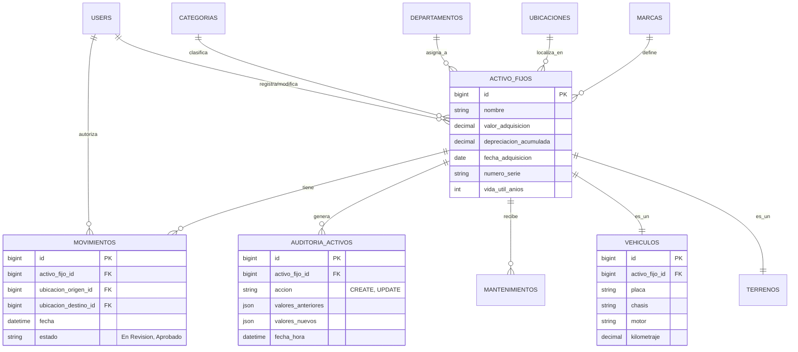
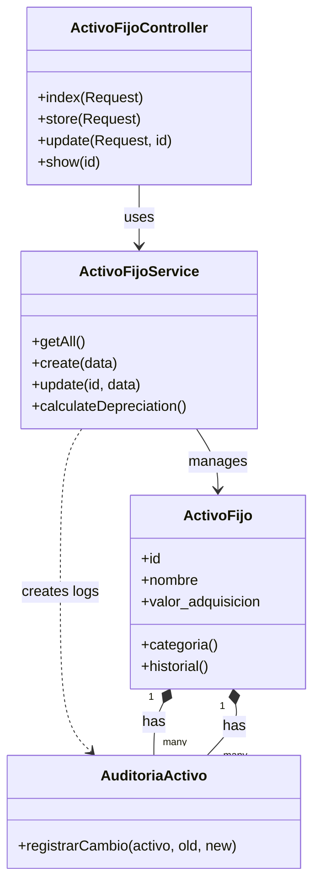
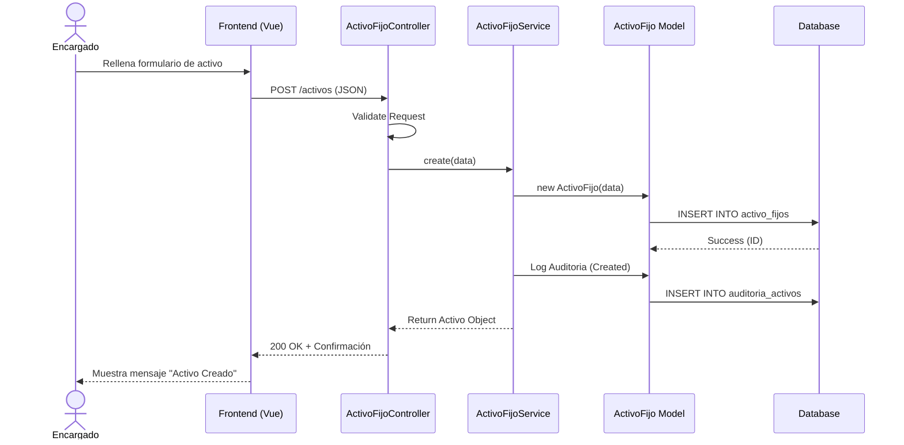

# Documentación de Ingeniería de Software - SIAFNIN

## 1. Introducción
Este documento detalla la especificación técnica del Sistema de Información de Activos Fijos (SIAFNIN). Su propósito es servir como referencia para el modelado en herramientas CASE como Magic Draw, demostrando la robustez y completitud del sistema.

## 2. Especificación de Requisitos de Software (SRS)

### 2.1. Requisitos Funcionales
El sistema permite la gestión integral del ciclo de vida de los activos fijos municipales.

#### Módulo de Seguridad y Accesos (RBAC)
*   **RF-01**: El sistema debe autenticar usuarios mediante correo y contraseña.
*   **RF-02**: El sistema debe restringir el acceso a módulos según el rol del usuario (Administrador, Responsable de Activos, Auditor).
*   **RF-03**: El sistema debe mantener un registro de auditoría (log) de todas las modificaciones a los activos.

#### Módulo de Gestión de Activos
*   **RF-04**: Permitir el registro de activos con datos financieros (valor, vida útil), técnicos (serie, modelo) y administrativos (ubicación, responsable).
*   **RF-05**: Calcular automáticamente la depreciación acumulada y valor en libros.
*   **RF-06**: Generar etiquetas o fichas de activo para impresión.
*   **RF-07**: Mantener un historial de cambios para cada activo (quién modificó qué y cuándo).

#### Módulo de Movimientos y Traslados
*   **RF-08**: Registrar solicitudes de traslado de activos entre ubicaciones o responsables.
*   **RF-09**: Implementar un flujo de autorización para traslados (Solicitud -> Aprobación/Rechazo).
*   **RF-10**: Generar Actas de Asignación y Traslado en formato PDF/Imprimible.

#### Módulo de Reportes
*   **RF-11**: Generar reportes de inventario general filtrado por ubicación, departamento o categoría.
*   **RF-12**: Generar reporte de depreciación mensual y anual.

### 2.2. Requisitos No Funcionales
*   **RNF-01 (Seguridad)**: Las contraseñas deben estar encriptadas (Bcrypt).
*   **RNF-02 (Auditabilidad)**: No se permite el borrado físico de registros históricos (Soft Deletes o tablas de auditoría).
*   **RNF-03 (Performance)**: La carga de listados de activos no debe exceder los 2 segundos (paginación server-side).
*   **RNF-04 (Usabilidad)**: La interfaz debe ser responsiva y accesible desde dispositivos móviles para lectura de QR.

---

## 3. Modelo de Casos de Uso
Diagramas para plasmar en Magic Draw como **Use Case Diagrams**.

### 3.1. Actores del Sistema
*   **Administrador del Sistema**: Gestiona usuarios, roles y configuración global.
*   **Encargado de Activos**: Usuario principal operative. Registra altas, bajas y movimientos.
*   **Responsable de Área**: Usuario que recibe los equipos (Usuario Final pasivo).
*   **Auditor**: Usuario con permisos de solo lectura para revisar inventarios y logs.

### 3.2. Diagrama Principal de Casos de Uso (Mermaid)

```mermaid
useCaseDiagram
    actor "Administrador" as Admin
    actor "Encargado de Activos" as Encargado
    actor "Auditor" as Auditor

    package "Gestión de Seguridad" {
        usecase "Gestionar Usuarios" as UC1
        usecase "Asignar Roles" as UC2
    }

    package "Gestión de Activos" {
        usecase "Registrar Activo" as UC3
        usecase "Actualizar Activo" as UC4
        usecase "Dar de Baja Activo" as UC5
        usecase "Consultar Historial" as UC6
    }

    package "Operaciones" {
        usecase "Solicitar Traslado" as UC7
        usecase "Autorizar Traslado" as UC8
        usecase "Generar Reportes" as UC9
    }

    Admin --> UC1
    Admin --> UC2
    Admin --> UC9

    Encargado --> UC3
    Encargado --> UC4
    Encargado --> UC5
    Encargado --> UC7
    Encargado --> UC9

    Auditor --> UC6
    Auditor --> UC9

    UC7 .> UC8 : include
```

---

## 4. Modelo de Datos (ERD)
Diagrama para plasmar en Magic Draw como **Entity Relationship Diagram**.
Este esquema muestra una base de datos normalizada para mantener la integridad de la información histórica y relacional.



---

## 5. Diagrama de Clases (Arquitectura)
Este diagrama representa la arquitectura MVC + Service Layer implementada en el código.



## 6. Diagrama de Secuencia: Alta de Activo
Flujo crítico que demuestra la interacción entre usuario, controlador, servicio y base de datos con auditoría.


