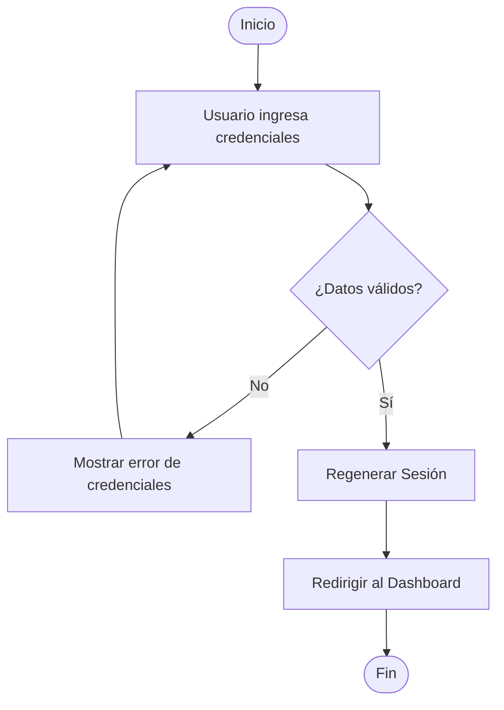
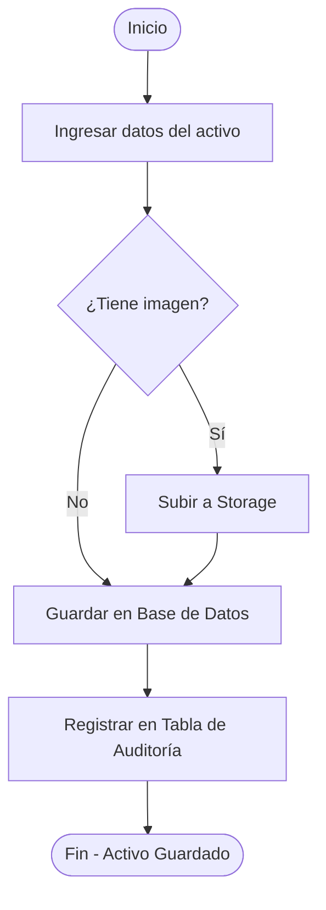
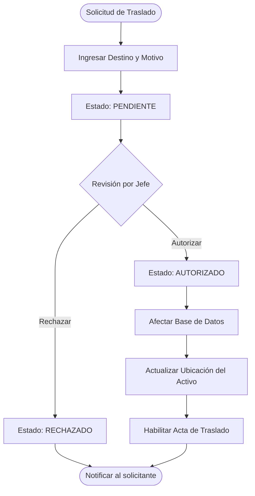
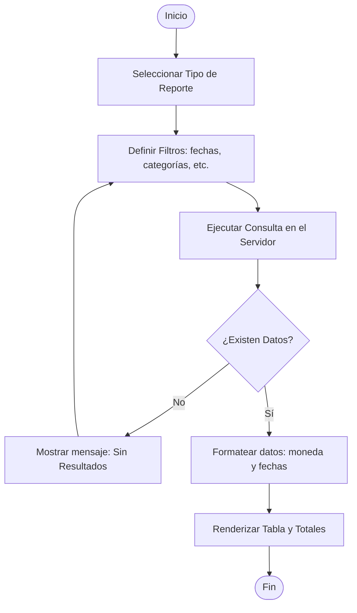
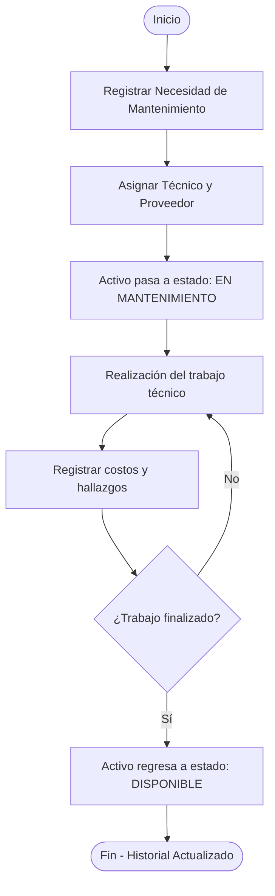
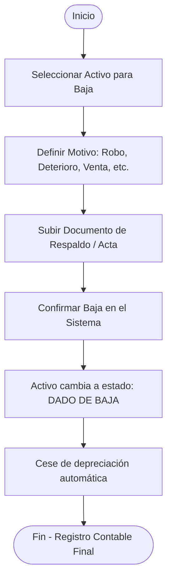
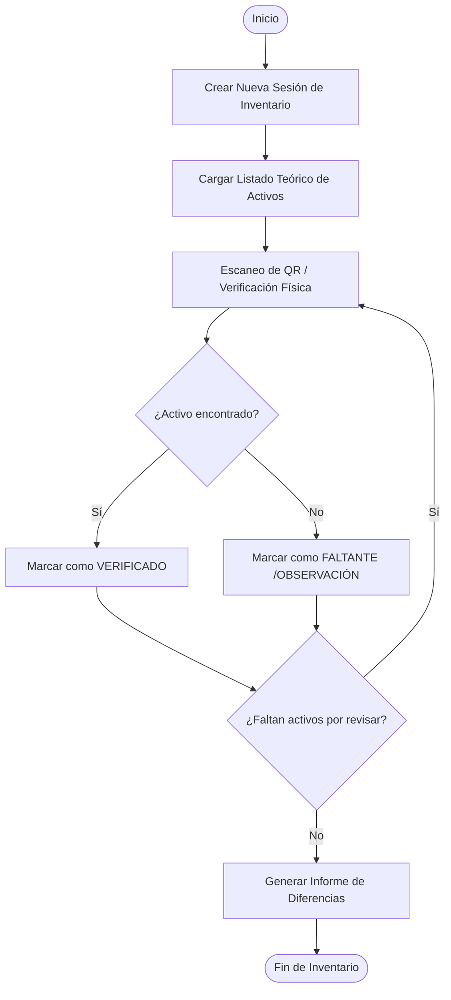
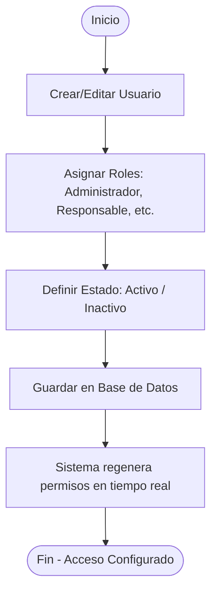
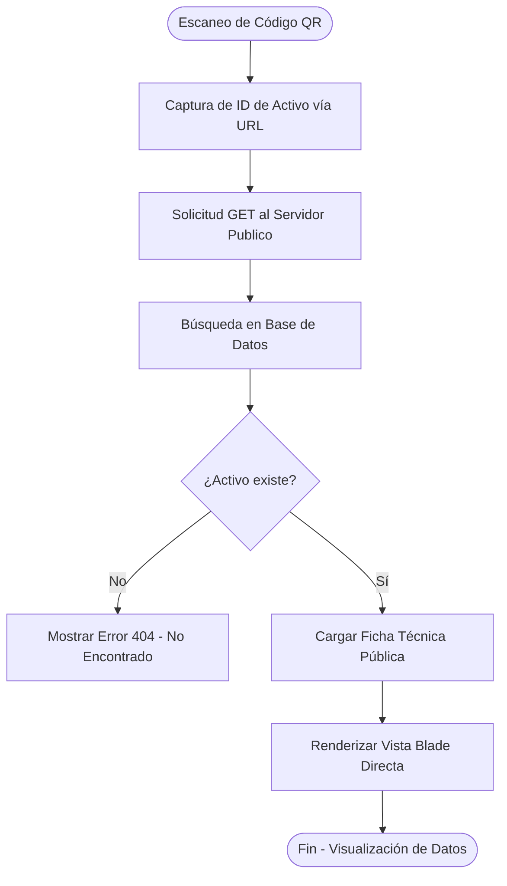
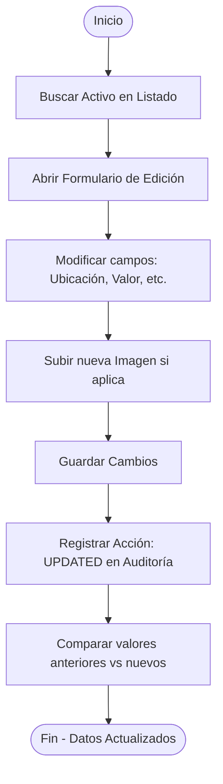

# Diagramas de Actividad del Sistema - SIAFNIN

A diferencia de los diagramas de secuencia (que muestran quién habla con quién), los **Diagramas de Actividad** funcionan como diagramas de flujo que describen la lógica de los procesos y la toma de decisiones.

---

## 1. Proceso de Autenticación (Login)

---

## 2. Proceso de Alta de Activo

---

## 3. Proceso de Traslado (Movimiento)

Este diagrama muestra el flujo de decisión desde la solicitud hasta la actualización física del activo.

---

## 4. Proceso de Generación de Reportes

---

## 5. Proceso de Gestión de Mantenimiento

---

## 6. Proceso de Baja de Activo

---

## 7. Proceso de Inventario Físico (Verificación)

---

## 8. Proceso de Gestión de Usuarios (RBAC)

---

## 9. Proceso de Consulta Pública (Escaneo QR)

Este proceso es vital para la transparencia y auditoría externa sin necesidad de que el auditor esté logueado.

---

## 10. Proceso de Edición de Datos de Activo

---

> [!NOTE]
> Estos diagramas utilizan la sintaxis `graph TD` de Mermaid, que es el estándar para representar diagramas de actividad y flujos de proceso.
