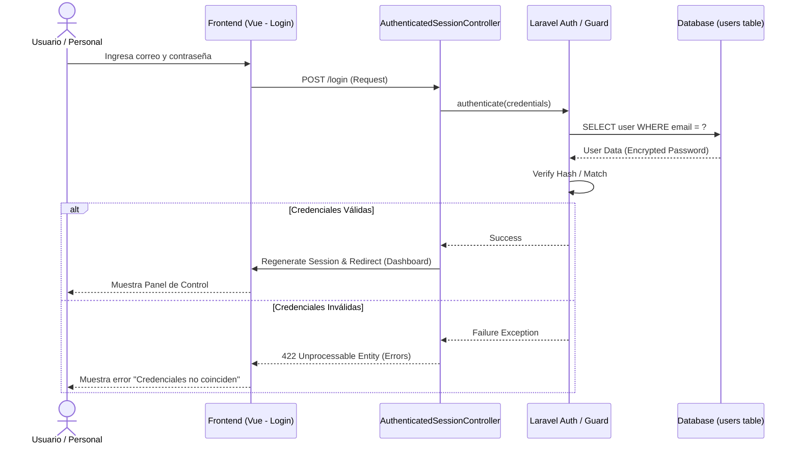
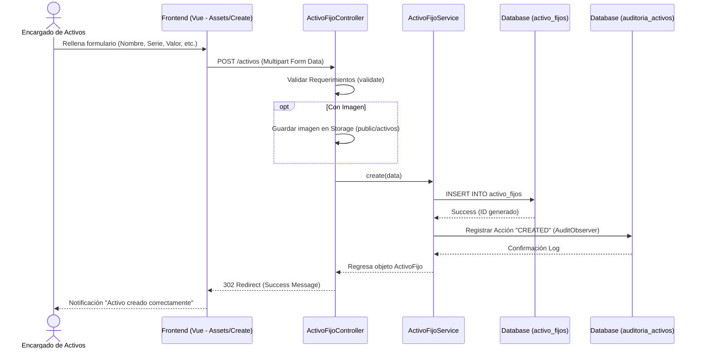
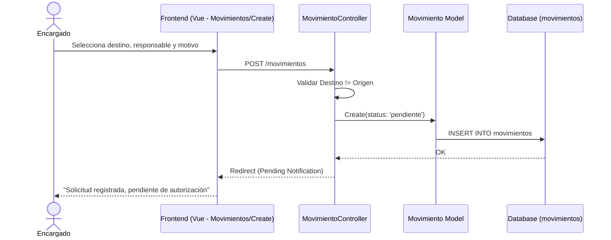
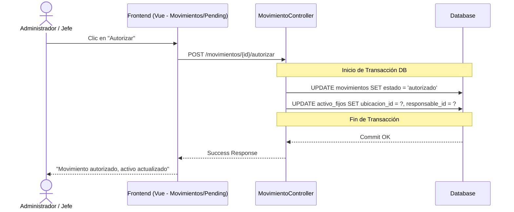
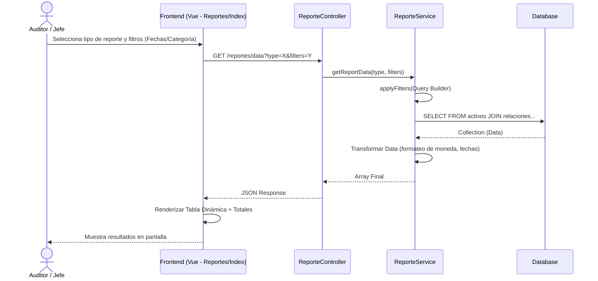
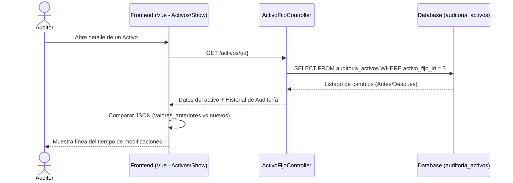

# Diagramas de Secuencia del Sistema - SIAFNIN

Este documento contiene los flujos lógicos detallados de los procesos críticos del sistema, representados mediante diagramas de secuencia de **Mermaid**. Estos diagramas son ideales para visualizar la interacción entre el usuario, el frontend, controladores, servicios y la base de datos.

---

## 1. Módulo de Seguridad: Autenticación (Login)

Este diagrama muestra el flujo desde que el usuario ingresa sus credenciales hasta que el sistema regenera la sesión.

---

## 2. Gestión de Activos: Alta de Activo (Registro)

Proceso central de registro de bienes en el sistema, incluyendo la persistencia en base de datos y el registro automático en la tabla de auditoría.

---

## 3. Operaciones: Traslado de Activo (Movimiento)

Este flujo es complejo ya que involucra dos estados: la creación de una solicitud pendiente y su posterior autorización por un superior.

### 3.1. Solicitud de Traslado

### 3.2. Autorización de Traslado

---

## 4. Módulo de Reportes: Generación de Datos

Flujo de consulta y filtrado dinámico utilizado para visualizar inventarios o cálculos de depreciación.

---

## 5. Auditoría: Seguimiento de Cambios (Logs)

Muestra cómo el sistema recupera el historial de lo que ha sucedido con un bien específico.

---

> [!TIP]
> Puedes visualizar estos diagramas copiando el código en el [Mermaid Live Editor](https://mermaid.live).
