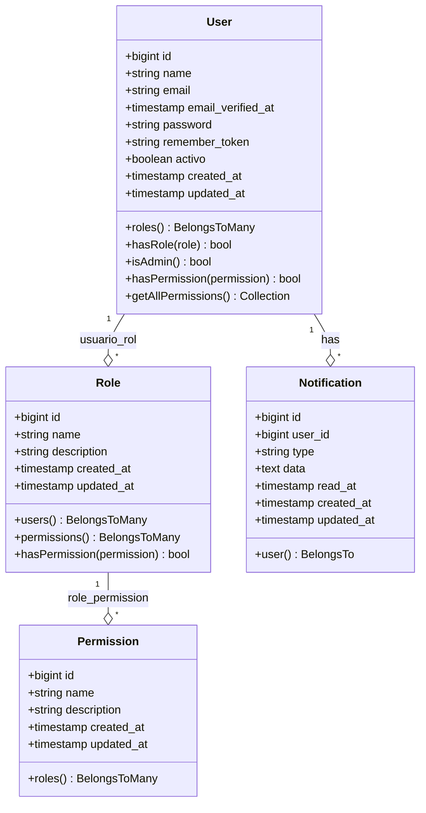

```mermaid
classDiagram
    %% ============================================
    %% MÓDULO: AUTENTICACIÓN Y AUTORIZACIÓN
    %% ============================================
    
    class User {
        +bigint id
        +string name
        +string email
        +timestamp email_verified_at
        +string password
        +string remember_token
        +boolean activo
        +timestamp created_at
        +timestamp updated_at
        +roles() BelongsToMany
        +hasRole(role) bool
        +isAdmin() bool
        +hasPermission(permission) bool
        +getAllPermissions() Collection
    }
    
    class Role {
        +bigint id
        +string name
        +string description
        +timestamp created_at
        +timestamp updated_at
        +users() BelongsToMany
        +permissions() BelongsToMany
        +hasPermission(permission) bool
    }
    
    class Permission {
        +bigint id
        +string name
        +string description
        +timestamp created_at
        +timestamp updated_at
        +roles() BelongsToMany
    }
    
    class Notification {
        +bigint id
        +bigint user_id
        +string type
        +text data
        +timestamp read_at
        +timestamp created_at
        +timestamp updated_at
        +user() BelongsTo
    }
    
    %% Relaciones
    User "1" --o "*" Role : usuario_rol
    Role "1" --o "*" Permission : role_permission
    User "1" --o "*" Notification : has
```
