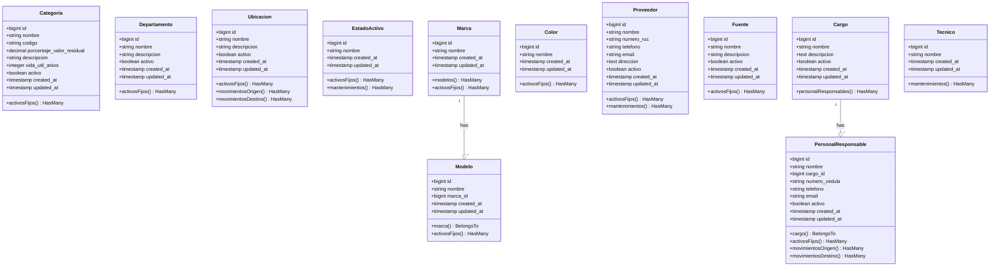

```mermaid
classDiagram
    %% ============================================
    %% MÓDULO: CATÁLOGOS MAESTROS
    %% ============================================
    
    class Categoria {
        +bigint id
        +string nombre
        +string codigo
        +decimal porcentaje_valor_residual
        +string descripcion
        +integer vida_util_anios
        +boolean activo
        +timestamp created_at
        +timestamp updated_at
        +activosFijos() HasMany
    }
    
    class Departamento {
        +bigint id
        +string nombre
        +string descripcion
        +boolean activo
        +timestamp created_at
        +timestamp updated_at
        +activosFijos() HasMany
    }
    
    class Ubicacion {
        +bigint id
        +string nombre
        +string descripcion
        +boolean activo
        +timestamp created_at
        +timestamp updated_at
        +activosFijos() HasMany
        +movimientosOrigen() HasMany
        +movimientosDestino() HasMany
    }
    
    class EstadoActivo {
        +bigint id
        +string nombre
        +timestamp created_at
        +timestamp updated_at
        +activosFijos() HasMany
        +mantenimientos() HasMany
    }
    
    class Marca {
        +bigint id
        +string nombre
        +timestamp created_at
        +timestamp updated_at
        +modelos() HasMany
        +activosFijos() HasMany
    }
    
    class Modelo {
        +bigint id
        +string nombre
        +bigint marca_id
        +timestamp created_at
        +timestamp updated_at
        +marca() BelongsTo
        +activosFijos() HasMany
    }
    
    class Color {
        +bigint id
        +string nombre
        +timestamp created_at
        +timestamp updated_at
        +activosFijos() HasMany
    }
    
    class Proveedor {
        +bigint id
        +string nombre
        +string numero_ruc
        +string telefono
        +string email
        +text direccion
        +boolean activo
        +timestamp created_at
        +timestamp updated_at
        +activosFijos() HasMany
        +mantenimientos() HasMany
    }
    
    class Fuente {
        +bigint id
        +string nombre
        +string descripcion
        +boolean activo
        +timestamp created_at
        +timestamp updated_at
        +activosFijos() HasMany
    }
    
    class Cargo {
        +bigint id
        +string nombre
        +text descripcion
        +boolean activo
        +timestamp created_at
        +timestamp updated_at
        +personalResponsables() HasMany
    }
    
    class PersonalResponsable {
        +bigint id
        +string nombre
        +bigint cargo_id
        +string numero_cedula
        +string telefono
        +string email
        +boolean activo
        +timestamp created_at
        +timestamp updated_at
        +cargo() BelongsTo
        +activosFijos() HasMany
        +movimientosOrigen() HasMany
        +movimientosDestino() HasMany
    }
    
    class Tecnico {
        +bigint id
        +string nombre
        +timestamp created_at
        +timestamp updated_at
        +mantenimientos() HasMany
    }
    
    %% Relaciones entre catálogos
    Marca "1" --o "*" Modelo : has
    Cargo "1" --o "*" PersonalResponsable : has
```
