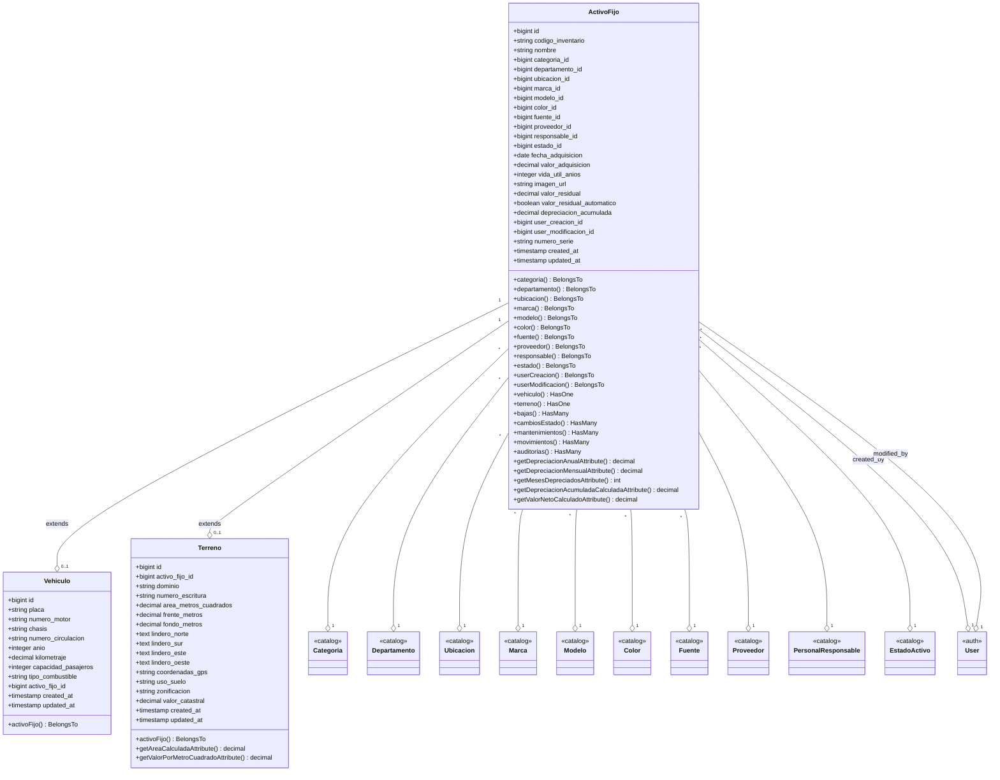

```mermaid
classDiagram
    %% ============================================
    %% MÓDULO: ACTIVOS FIJOS PRINCIPALES
    %% ============================================
    
    class ActivoFijo {
        +bigint id
        +string codigo_inventario
        +string nombre
        +bigint categoria_id
        +bigint departamento_id
        +bigint ubicacion_id
        +bigint marca_id
        +bigint modelo_id
        +bigint color_id
        +bigint fuente_id
        +bigint proveedor_id
        +bigint responsable_id
        +bigint estado_id
        +date fecha_adquisicion
        +decimal valor_adquisicion
        +integer vida_util_anios
        +string imagen_url
        +decimal valor_residual
        +boolean valor_residual_automatico
        +decimal depreciacion_acumulada
        +bigint user_creacion_id
        +bigint user_modificacion_id
        +string numero_serie
        +timestamp created_at
        +timestamp updated_at
        +categoria() BelongsTo
        +departamento() BelongsTo
        +ubicacion() BelongsTo
        +marca() BelongsTo
        +modelo() BelongsTo
        +color() BelongsTo
        +fuente() BelongsTo
        +proveedor() BelongsTo
        +responsable() BelongsTo
        +estado() BelongsTo
        +userCreacion() BelongsTo
        +userModificacion() BelongsTo
        +vehiculo() HasOne
        +terreno() HasOne
        +bajas() HasMany
        +cambiosEstado() HasMany
        +mantenimientos() HasMany
        +movimientos() HasMany
        +auditorias() HasMany
        +getDepreciacionAnualAttribute() decimal
        +getDepreciacionMensualAttribute() decimal
        +getMesesDepreciadosAttribute() int
        +getDepreciacionAcumuladaCalculadaAttribute() decimal
        +getValorNetoCalculadoAttribute() decimal
    }
    
    class Vehiculo {
        +bigint id
        +string placa
        +string numero_motor
        +string chasis
        +string numero_circulacion
        +integer anio
        +decimal kilometraje
        +integer capacidad_pasajeros
        +string tipo_combustible
        +bigint activo_fijo_id
        +timestamp created_at
        +timestamp updated_at
        +activoFijo() BelongsTo
    }
    
    class Terreno {
        +bigint id
        +bigint activo_fijo_id
        +string dominio
        +string numero_escritura
        +decimal area_metros_cuadrados
        +decimal frente_metros
        +decimal fondo_metros
        +text lindero_norte
        +text lindero_sur
        +text lindero_este
        +text lindero_oeste
        +string coordenadas_gps
        +string uso_suelo
        +string zonificacion
        +decimal valor_catastral
        +timestamp created_at
        +timestamp updated_at
        +activoFijo() BelongsTo
        +getAreaCalculadaAttribute() decimal
        +getValorPorMetroCuadradoAttribute() decimal
    }
    
    %% Relaciones principales
    ActivoFijo "1" --o "0..1" Vehiculo : extends
    ActivoFijo "1" --o "0..1" Terreno : extends
    
    %% Relaciones con catálogos (simplificadas)
    ActivoFijo "*" --o "1" Categoria
    ActivoFijo "*" --o "1" Departamento
    ActivoFijo "*" --o "1" Ubicacion
    ActivoFijo "*" --o "1" Marca
    ActivoFijo "*" --o "1" Modelo
    ActivoFijo "*" --o "1" Color
    ActivoFijo "*" --o "1" Fuente
    ActivoFijo "*" --o "1" Proveedor
    ActivoFijo "*" --o "1" PersonalResponsable
    ActivoFijo "*" --o "1" EstadoActivo
    ActivoFijo "*" --o "1" User : created_by
    ActivoFijo "*" --o "1" User : modified_by
    
    class Categoria {
        <<catalog>>
    }
    class Departamento {
        <<catalog>>
    }
    class Ubicacion {
        <<catalog>>
    }
    class Marca {
        <<catalog>>
    }
    class Modelo {
        <<catalog>>
    }
    class Color {
        <<catalog>>
    }
    class Fuente {
        <<catalog>>
    }
    class Proveedor {
        <<catalog>>
    }
    class PersonalResponsable {
        <<catalog>>
    }
    class EstadoActivo {
        <<catalog>>
    }
    class User {
        <<auth>>
    }
```
