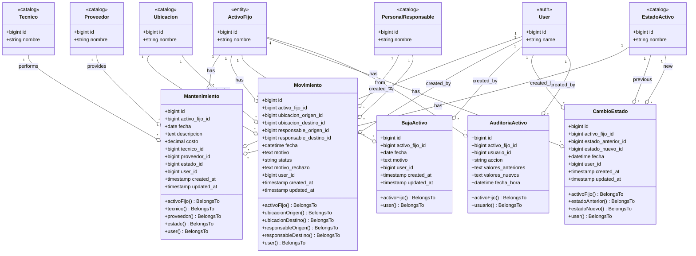

```mermaid
classDiagram
    %% ============================================
    %% MÓDULO: TRANSACCIONES DE ACTIVOS
    %% ============================================
    
    class Mantenimiento {
        +bigint id
        +bigint activo_fijo_id
        +date fecha
        +text descripcion
        +decimal costo
        +bigint tecnico_id
        +bigint proveedor_id
        +bigint estado_id
        +bigint user_id
        +timestamp created_at
        +timestamp updated_at
        +activoFijo() BelongsTo
        +tecnico() BelongsTo
        +proveedor() BelongsTo
        +estado() BelongsTo
        +user() BelongsTo
    }
    
    class Movimiento {
        +bigint id
        +bigint activo_fijo_id
        +bigint ubicacion_origen_id
        +bigint ubicacion_destino_id
        +bigint responsable_origen_id
        +bigint responsable_destino_id
        +datetime fecha
        +text motivo
        +string status
        +text motivo_rechazo
        +bigint user_id
        +timestamp created_at
        +timestamp updated_at
        +activoFijo() BelongsTo
        +ubicacionOrigen() BelongsTo
        +ubicacionDestino() BelongsTo
        +responsableOrigen() BelongsTo
        +responsableDestino() BelongsTo
        +user() BelongsTo
    }
    
    class BajaActivo {
        +bigint id
        +bigint activo_fijo_id
        +date fecha
        +text motivo
        +bigint user_id
        +timestamp created_at
        +timestamp updated_at
        +activoFijo() BelongsTo
        +user() BelongsTo
    }
    
    class CambioEstado {
        +bigint id
        +bigint activo_fijo_id
        +bigint estado_anterior_id
        +bigint estado_nuevo_id
        +datetime fecha
        +bigint user_id
        +timestamp created_at
        +timestamp updated_at
        +activoFijo() BelongsTo
        +estadoAnterior() BelongsTo
        +estadoNuevo() BelongsTo
        +user() BelongsTo
    }
    
    class AuditoriaActivo {
        +bigint id
        +bigint activo_fijo_id
        +bigint usuario_id
        +string accion
        +text valores_anteriores
        +text valores_nuevos
        +datetime fecha_hora
        +activoFijo() BelongsTo
        +usuario() BelongsTo
    }
    
    %% Referencias simplificadas
    class ActivoFijo {
        <<entity>>
        +bigint id
        +string nombre
    }
    
    class User {
        <<auth>>
        +bigint id
        +string name
    }
    
    class Ubicacion {
        <<catalog>>
        +bigint id
        +string nombre
    }
    
    class PersonalResponsable {
        <<catalog>>
        +bigint id
        +string nombre
    }
    
    class EstadoActivo {
        <<catalog>>
        +bigint id
        +string nombre
    }
    
    class Tecnico {
        <<catalog>>
        +bigint id
        +string nombre
    }
    
    class Proveedor {
        <<catalog>>
        +bigint id
        +string nombre
    }
    
    %% Relaciones
    ActivoFijo "1" --o "*" Mantenimiento : has
    ActivoFijo "1" --o "*" Movimiento : has
    ActivoFijo "1" --o "*" BajaActivo : has
    ActivoFijo "1" --o "*" CambioEstado : has
    ActivoFijo "1" --o "*" AuditoriaActivo : has
    
    User "1" --o "*" Mantenimiento : created_by
    User "1" --o "*" Movimiento : created_by
    User "1" --o "*" BajaActivo : created_by
    User "1" --o "*" CambioEstado : created_by
    User "1" --o "*" AuditoriaActivo : created_by
    
    Tecnico "1" --o "*" Mantenimiento : performs
    Proveedor "1" --o "*" Mantenimiento : provides
    EstadoActivo "1" --o "*" Mantenimiento : has
    
    Ubicacion "1" --o "*" Movimiento : origin
    Ubicacion "1" --o "*" Movimiento : destination
    PersonalResponsable "1" --o "*" Movimiento : from
    PersonalResponsable "1" --o "*" Movimiento : to
    
    EstadoActivo "1" --o "*" CambioEstado : previous
    EstadoActivo "1" --o "*" CambioEstado : new
```
