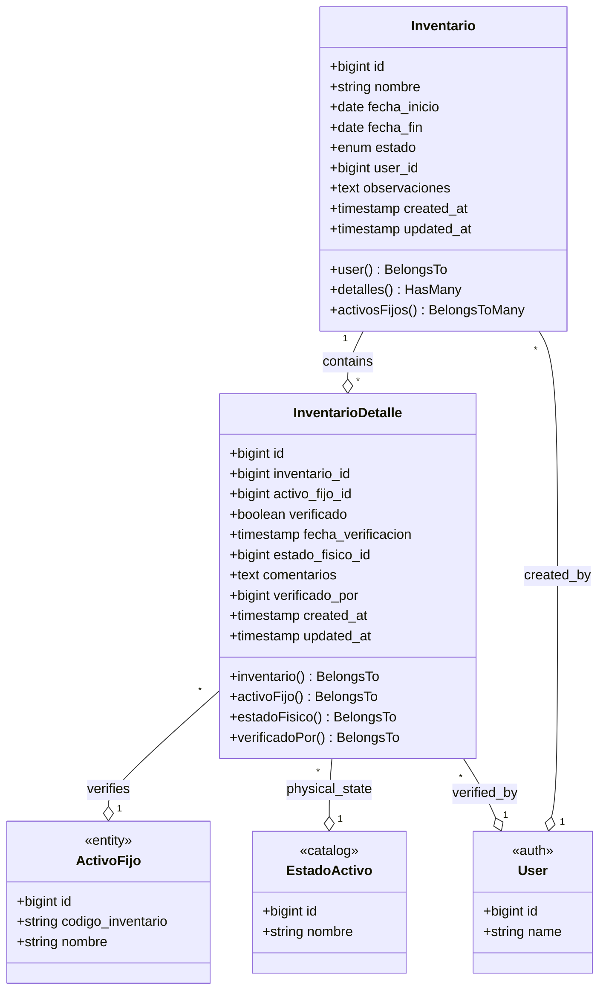

```mermaid
classDiagram
    %% ============================================
    %% MÓDULO: INVENTARIOS
    %% ============================================
    
    class Inventario {
        +bigint id
        +string nombre
        +date fecha_inicio
        +date fecha_fin
        +enum estado
        +bigint user_id
        +text observaciones
        +timestamp created_at
        +timestamp updated_at
        +user() BelongsTo
        +detalles() HasMany
        +activosFijos() BelongsToMany
    }
    
    class InventarioDetalle {
        +bigint id
        +bigint inventario_id
        +bigint activo_fijo_id
        +boolean verificado
        +timestamp fecha_verificacion
        +bigint estado_fisico_id
        +text comentarios
        +bigint verificado_por
        +timestamp created_at
        +timestamp updated_at
        +inventario() BelongsTo
        +activoFijo() BelongsTo
        +estadoFisico() BelongsTo
        +verificadoPor() BelongsTo
    }
    
    %% Referencias simplificadas
    class User {
        <<auth>>
        +bigint id
        +string name
    }
    
    class ActivoFijo {
        <<entity>>
        +bigint id
        +string codigo_inventario
        +string nombre
    }
    
    class EstadoActivo {
        <<catalog>>
        +bigint id
        +string nombre
    }
    
    %% Relaciones
    Inventario "1" --o "*" InventarioDetalle : contains
    Inventario "*" --o "1" User : created_by
    
    InventarioDetalle "*" --o "1" ActivoFijo : verifies
    InventarioDetalle "*" --o "1" EstadoActivo : physical_state
    InventarioDetalle "*" --o "1" User : verified_by
```
