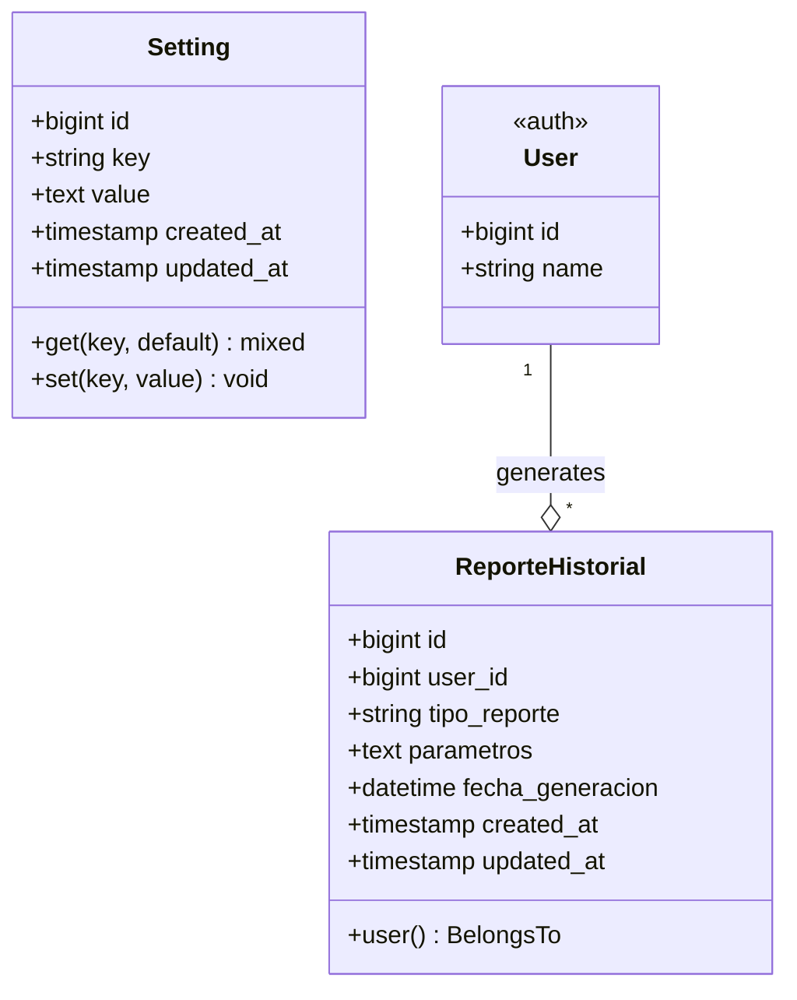

```mermaid
classDiagram
    %% ============================================
    %% MÓDULO: SISTEMA Y REPORTES
    %% ============================================
    
    class Setting {
        +bigint id
        +string key
        +text value
        +timestamp created_at
        +timestamp updated_at
        +get(key, default) mixed
        +set(key, value) void
    }
    
    class ReporteHistorial {
        +bigint id
        +bigint user_id
        +string tipo_reporte
        +text parametros
        +datetime fecha_generacion
        +timestamp created_at
        +timestamp updated_at
        +user() BelongsTo
    }
    
    %% Referencias simplificadas
    class User {
        <<auth>>
        +bigint id
        +string name
    }
    
    %% Relaciones
    User "1" --o "*" ReporteHistorial : generates
```
